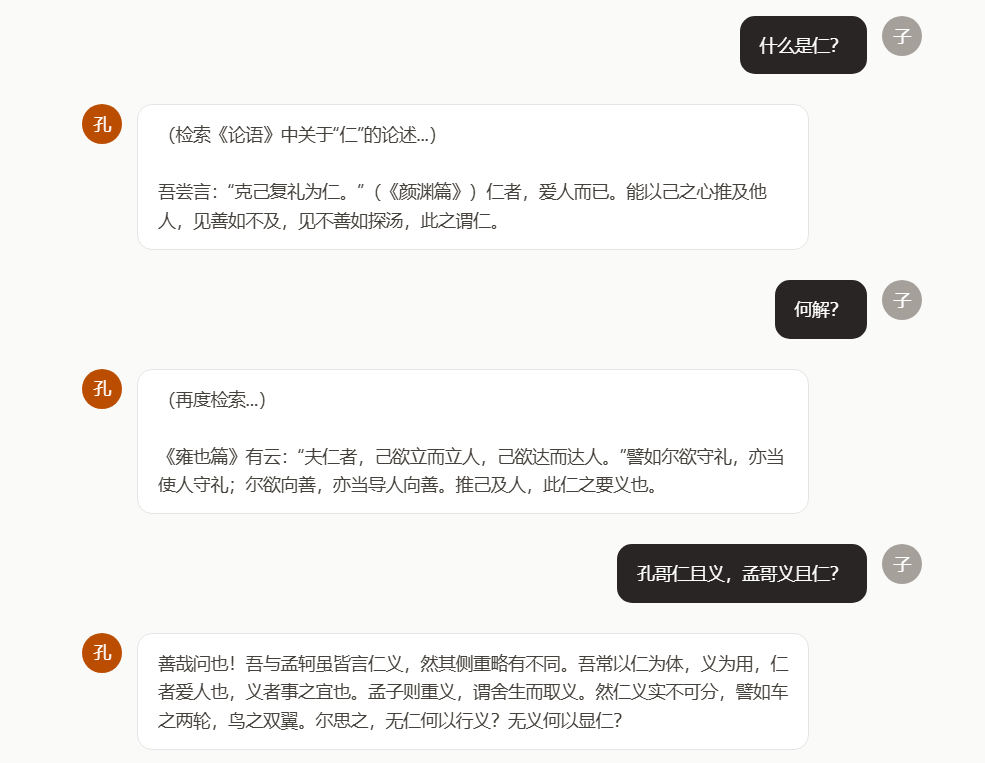

# 孔夫子 AI 聊天助手

以孔子风格回复的 AI 对话助手。结合《论语》全文（20 篇 512 章）RAG 知识库，Agent 自主决策检索时机，回答引经据典、有源可循。



## 架构

```
                        ┌─────────────────────┐
                        │     React 前端        │
                        │  localhost:5173       │
                        └──────────┬──────────┘
                                   │ HTTP + SSE
                                   ▼
                        ┌─────────────────────┐
                        │   FastAPI 后端        │
                        │  localhost:8000       │
                        │                      │
                        │  ┌─────────────────┐ │
                        │  │  Agent 循环       │ │
                        │  │  LLM 自主决策:    │ │
                        │  │  闲聊→直接回复   │ │
                        │  │  求教→调工具→查书│ │
                        │  └────────┬────────┘ │
                        │           │           │
                        │  ┌────────┴────────┐ │
                        │  │ RAG 检索 → Prompt│ │
                        │  │ 注入 → LLM 回复  │ │
                        │  └────────┬────────┘ │
                        │           │           │
                        │  ┌────────┴────────┐ │
                        │  │ SQLite + ChromaDB│ │
                        │  └─────────────────┘ │
                        └──────────┬──────────┘
                                   │ HTTPS
                                   ▼
                        ┌─────────────────────┐
                        │   DeepSeek API       │
                        │   api.deepseek.com   │
                        └─────────────────────┘
```

## 技术栈

| 层 | 技术 |
|----|------|
| 大模型 | DeepSeek API (OpenAI SDK + Function Calling) |
| Embedding | BGE-large-zh (本地部署, 1024 维) |
| 向量库 | ChromaDB (HNSW 索引) |
| 后端 | FastAPI + SSE 流式 |
| 数据库 | SQLite (SQLAlchemy ORM) |
| 鉴权 | JWT + bcrypt |
| 测试 | pytest (55+ 单元/Mock/E2E) |
| 部署 | Docker Compose + Nginx + GitHub Actions CI |

## 快速开始

### 环境要求

- Python 3.12+
- Node.js 22+

### 本地开发

```bash
# 后端
cd backend
python -m venv .venv
source .venv/Scripts/activate   # Windows, 或 . .venv/bin/activate (Linux/Mac)
pip install -r requirements.txt
# 编辑 .env 填入 DEEPSEEK_API_KEY
python -m uvicorn app.main:app --reload

# 前端
cd frontend
npm install
npm run dev
```

浏览器打开 http://localhost:5173

### Docker

```bash
echo "DEEPSEEK_API_KEY=sk-xxxx" > .env
docker compose up -d
```

浏览器打开 http://localhost

## 项目结构

```
kong/
├── backend/
│   ├── app/
│   │   ├── main.py              # FastAPI 入口
│   │   ├── config.py            # 配置管理
│   │   ├── routers/             # API 路由
│   │   │   ├── auth.py          # 认证 (注册/登录/JWT)
│   │   │   └── chat.py          # 对话 (Agent + 流式)
│   │   ├── services/
│   │   │   ├── agent.py         # Agent 循环 (ReAct)
│   │   │   ├── tools.py         # 工具注册表
│   │   │   ├── chat.py          # 基础对话函数
│   │   │   ├── auth.py          # 认证逻辑
│   │   │   └── conversation.py  # 对话持久化
│   │   ├── rag/
│   │   │   ├── chunker.py       # 文本分块 (按论语篇章)
│   │   │   ├── embedder.py      # BGE 向量化
│   │   │   ├── retriever.py     # ChromaDB 检索
│   │   │   └── builder.py       # 知识库构建
│   │   ├── llm/
│   │   │   ├── client.py        # DeepSeek API 客户端
│   │   │   └── prompts.py       # Prompt 模板
│   │   └── models/
│   │       └── database.py      # SQLAlchemy ORM
│   ├── data/
│   │   └── lunyu.json           # 论语数据
│   └── tests/
│       ├── conftest.py
│       ├── test_auth.py
│       ├── test_e2e.py
│       ├── test_edge_cases.py
│       ├── test_llm_mock.py
│       └── test_rag.py
├── frontend/
│   └── src/
│       ├── pages/               # Chat, Login
│       ├── components/          # UI 组件
│       └── lib/                 # API 客户端 + SSE 解析
├── docker-compose.yml
├── LearnList.md                 # 学习路线 (38 知识点)
├── LearnTalk.md                 # 学习对话笔记
└── README.md
```

## 核心设计决策

| 决策 | 选择 | 原因 |
|------|------|------|
| Embedding 方案 | BGE-large-zh 本地部署 | 中文 SOTA 效果，离线可用，零 API 成本；比通用模型多语言版精度更高 |
| 向量数据库 | ChromaDB | 512 条数据规模小，Python 原生 API 简单，自带持久化，不需要额外部署 |
| 分块策略 | 按《论语》篇章结构分章 | 每章语义完整，天然边界清晰，无需手动调 chunk size 和 overlap |
| Agent 实现 | Function Calling | 比硬编码分类扩展性强，新增工具只注册描述即可，不需要改核心逻辑 |
| 后端分层 | Router→Service→Client | 各层可独立 Mock 和测试，Bug 定位时快速圈定层级 |
| 鉴权 | JWT (无 Session) | 无状态，易扩展，服务节点独立验证 token，无需共享 Session |
| 数据库 | SQLite → 可迁移 PG | 开发期零配置，SQLAlchemy ORM 抽象层使切换数据库仅改一行连接串 |

## API

| 端点 | 说明 |
|------|------|
| POST /api/auth/register | 注册 |
| POST /api/auth/login | 登录 → JWT |
| GET /api/auth/me | 当前用户 |
| POST /api/chat | Agent 对话 |
| POST /api/chat/stream | 流式对话 |
| GET /api/chat/conversations | 对话列表 |
| GET /api/chat/conversations/:id | 对话详情 |
| DELETE /api/chat/conversations/:id | 删除对话 |

## 测试

```bash
cd backend
python -m pytest tests/ -v
```

55+ 测试，覆盖单元 / Mock / 端到端三层。

## License

MIT
